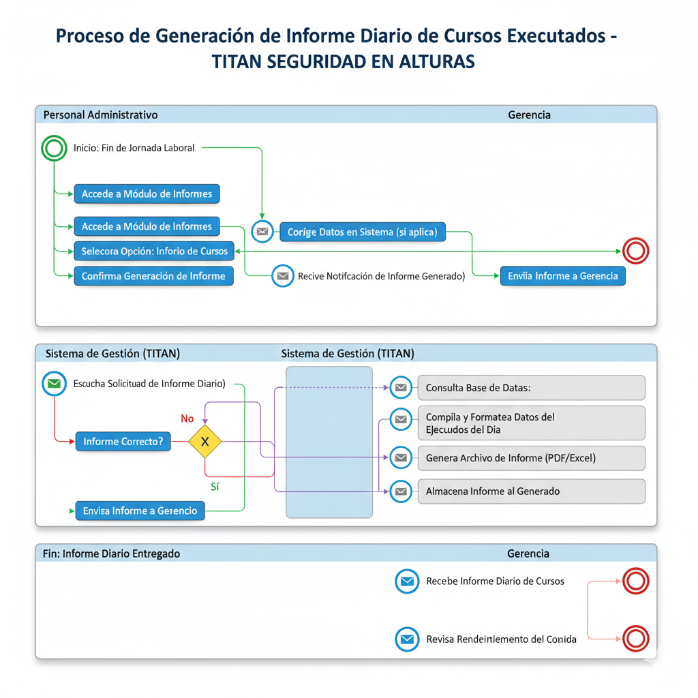

## Ejemplo 1: BPMN - Registro y Certificación de Participantes

Este diagrama ilustra el proceso completo desde que un nuevo participante se registra hasta que obtiene su certificado de alturas.

**Pools (Participantes/Roles):**
- **Participante:** La persona que toma el curso.
- **Personal Administrativo:** Encargado de la gestión de datos y certificados.
- **Sistema de Gestión (TITAN):** La aplicación de software que soporta el proceso.
- **Instructor:** El encargado de impartir la formación.
  
**Lanes (Funciones dentro de un Pool):**
- **Dentro de "Sistema de Gestión (TITAN)":** Módulo de Registro, Módulo de Cursos, Módulo de Certificados.

## Ejemplo 2: BPMN - Generación de Informe Diario de Cursos Ejecutados

Este diagrama muestra el proceso simplificado de cómo el personal administrativo, con el apoyo del sistema, genera el informe diario requerido al cierre de la jornada.

**Pools (Participantes/Roles):**
- **Personal Administrativo:** El usuario que solicita y revisa el informe.
- **Sistema de Gestión (TITAN):** La aplicación de software que genera el informe.
- **Gerencia:** El receptor final del informe.

  
